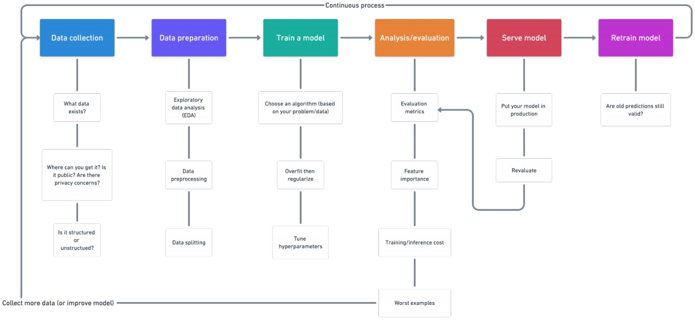

# data-science-machine-learning-toolkit
All the essential resources and template code needed to understand major data science and machine learning libraries like Numpy, Pandas, Matplotlib and Scikit Learn with few small projects to demonstrate their practical application.

## Framework followed :

## Process : 

